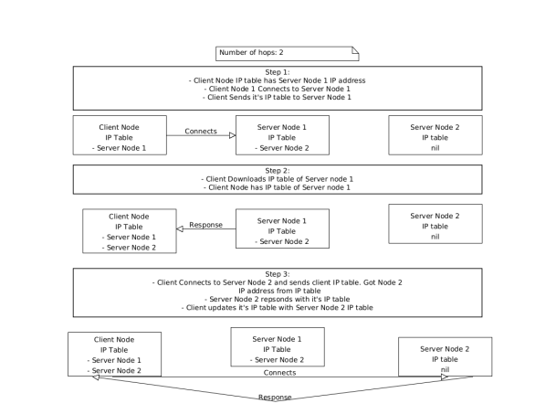
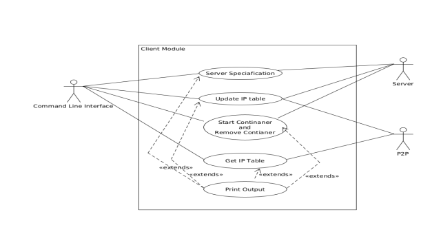

# Client Module Architecture 

The Client Module interacts with the P2P module and Server Module. It is responsible for
interacting with the server module and appropriately updating the IP table on the client side. It
connects to the server using the server's REST Apis. It is also the primary decision maker on how
the IP table is updated is on the client side. This is because each user can have requirements like
how many number of hops they would want to do to update their IP table. Hops is the number of
times the client is going to download the IP table from different servers ,once it gets the IP tables
from the previous servers. 

